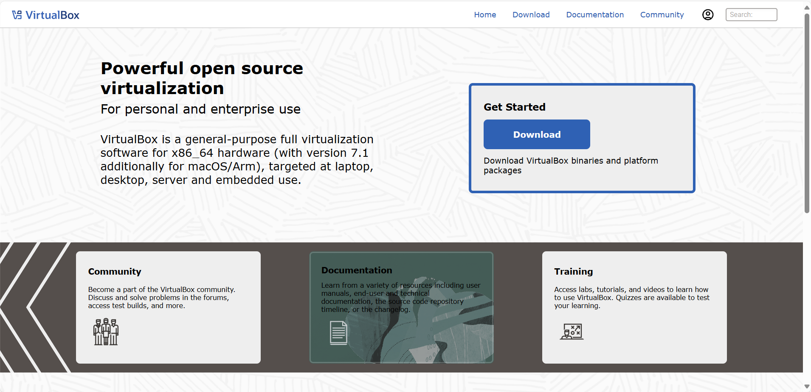
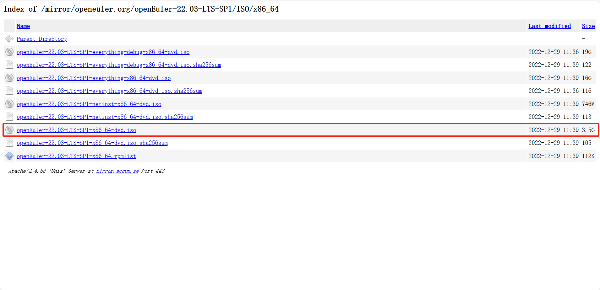
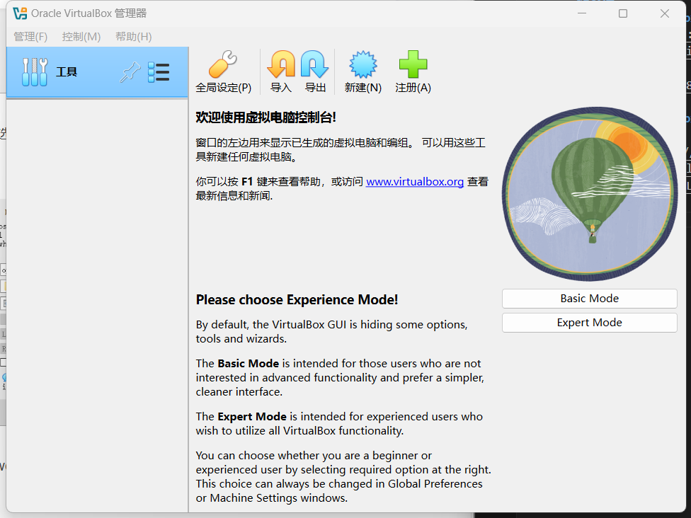
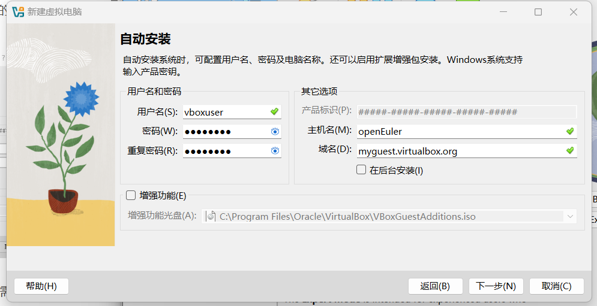
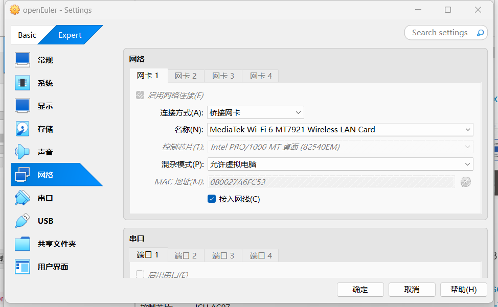
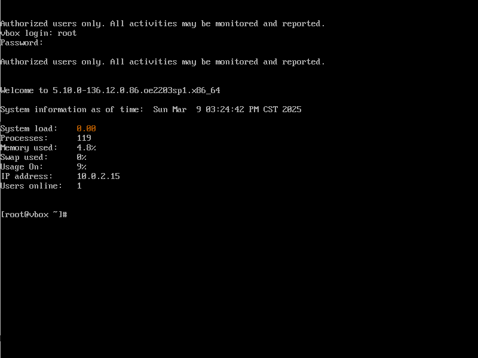
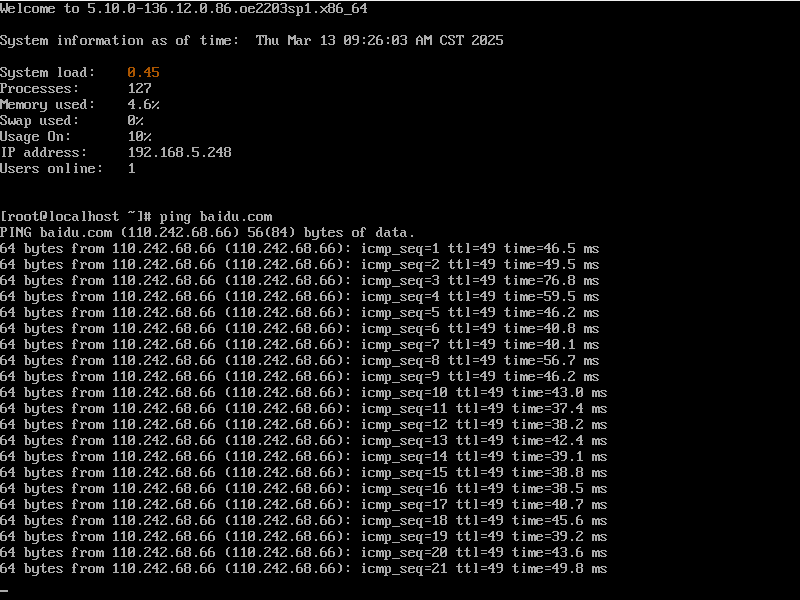

# 使用Virtualbox安装openEuler操作系统
### 下载Virutalbox
- 下载地址：https://www.virtualbox.org/wiki/Downloads
- 
### 安装openEuler操作系统
1.下载 openEuler 22.03 LTS-SP1 ISO 文件：https://mirror.accum.se/mirror/openeuler.org/openEuler-22.03-LTS-SP1/ISO/x86_64/
  - 这个是能满足大部分需求的版本，其余版本包含调试信息等，通常用于开发人员
2.导入openEuler操作系统到Virtualbox
  - 选择新建，然后输入新虚拟电脑的描述名称以及要安装的操作系统类型。
  - 进行网络配置  
3.重启后，登入设置的root密码 
4.验证网络连接
