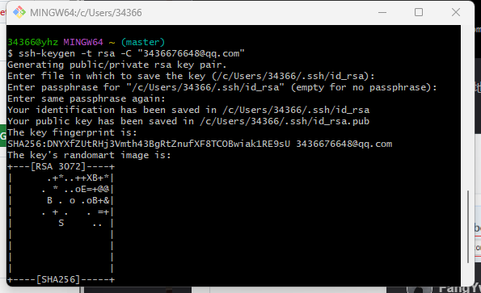
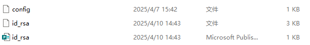
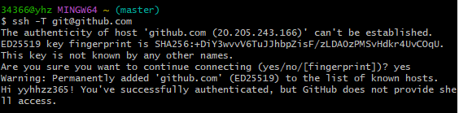
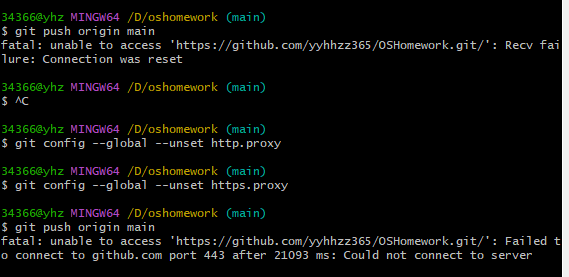
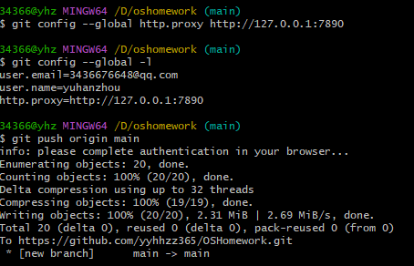
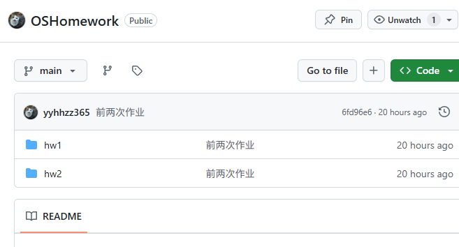
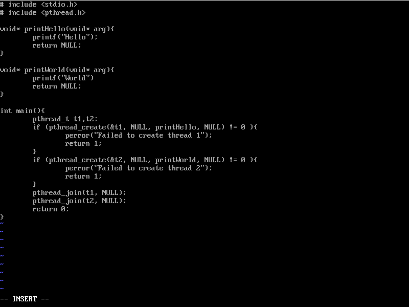
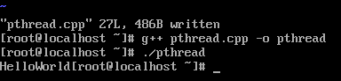

# 一：github仓库建立与配置
1. 注册登录后右上角创建new repository，设置仓库名称、描述、是否公开等信息
2. 安装git bash
3. 获取配置密钥
   - 打开git bash 输入``ssh-keygen -t rsa -C "3436676648@qq.com``
   - 打开.ssh文件位置，打开id_rsa.pub文件，复制密钥
   - 打开github设置，在SSH and GPG keys中添加SSH key并粘贴密钥
   - 打开git bash，输入``ssh -T git@github.com``测试是否成功
4. 上传文件
   - 输入``git config --global user.name "your name"``和``git config --global user.email "your email"``设置账号名和邮箱
   - 将github创建仓库git clone到本地
   - 打开git bash定位到本地仓库，输入``git add hw1 hw2`` 再输入``git commit -m "first commit"`` 然后输入``git push origin master``将本地仓库推送到github仓库。报错
   - 进行代理设置``git config --global http.proxy http://127.0.0.1:7890``，再次尝试成功 输入账号密码后成功
# 二：多线程测试
1. 打开openeuler
2. 输入``vi pthread.cpp``开始编写代码
3. 保存编译后运行，输出
