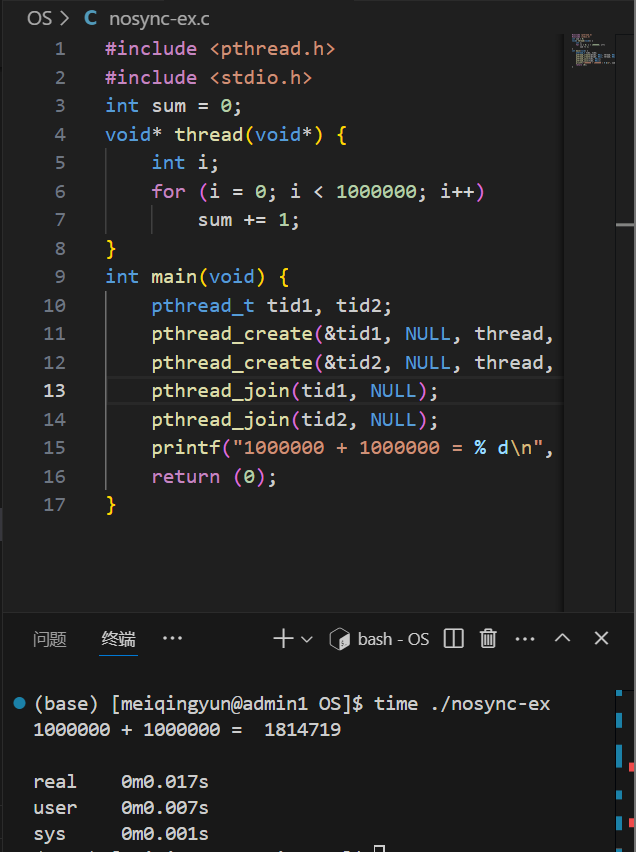
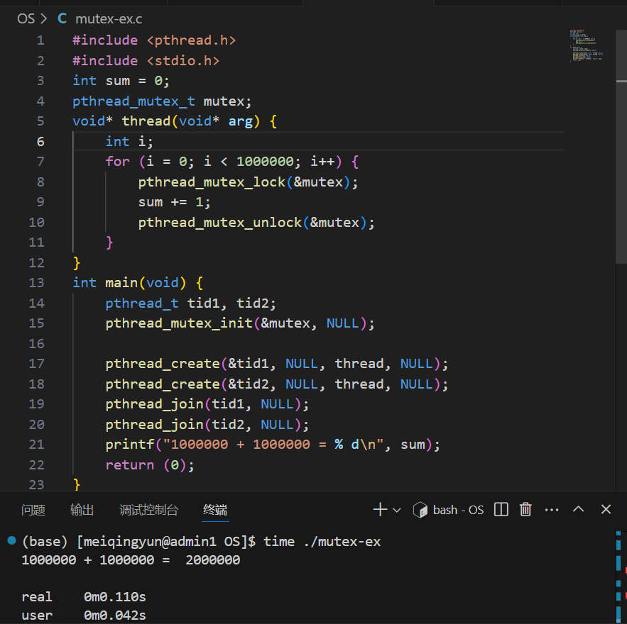
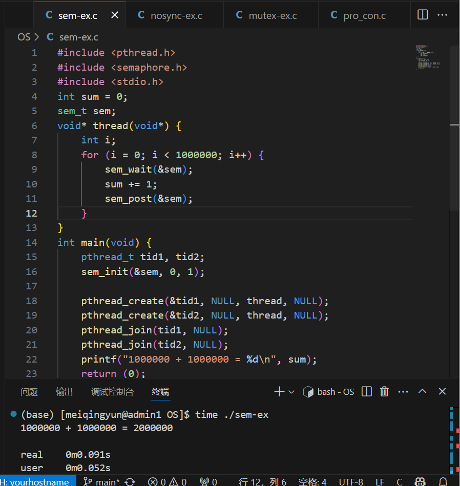
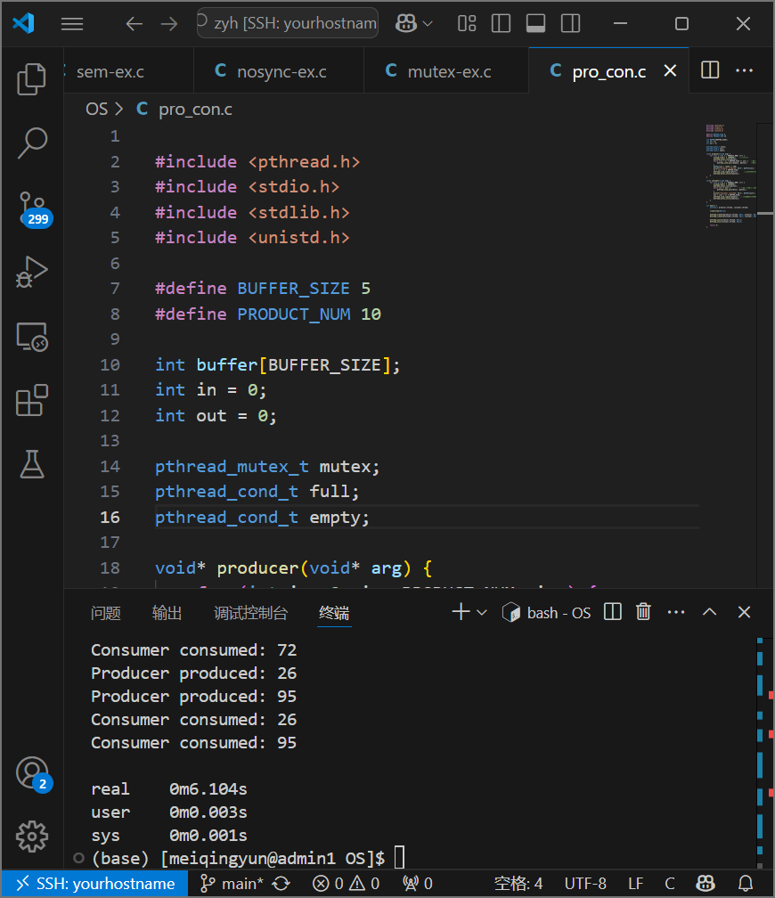

1. nosync-ex.c代码验证，运行输出结果如下图，发现结果不正确。

2. mutex-ex.c代码验证，运行输出结果如下图，发现结果正确。当一个线程访问资源时，使用mutex锁住即可防止另外线程也访问。

3. sem-ex.c代码验证，运行输出结果如下图，发现结果正确。使用sem设置只有1个线程可以访问资源。

4. 生产者消费者问题，运行结果如下
- 当生产者开始生产，使用mutex锁住使消费者无法消费，如果缓冲区满了则释放并使消费者开始消费，当消费者消费，使用mutex锁住使生产者无法消费，当消费缓冲区产生空位，则通知生产者可以开始生产释放锁。如果生产者生产，缓冲区不为空，则通知消费者有产品，并释放锁

